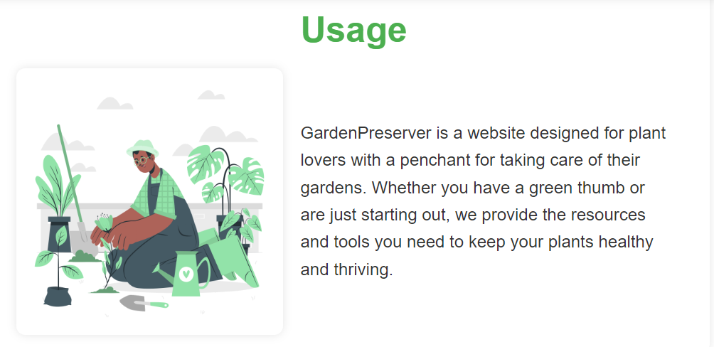
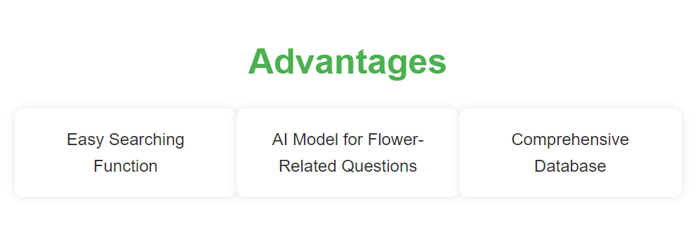
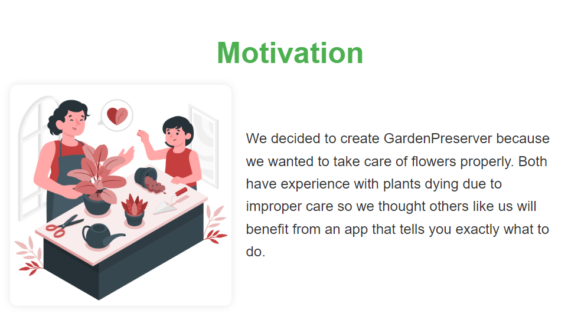

<!DOCTYPE html>
<html lang="en">
<head>
    <meta charset="UTF-8">
    <meta name="viewport" content="width=device-width, initial-scale=1.0">
</head>
<body>
    <header>
        <h1>GardenPreserver</h1>
    </header>
    <section>
        <h2>Overview:</h2>
        
GardenPreserver is a web application designed to help people with a black thumb care for their flowers..

        
The idea came because of a friend who had trouble caring for his lavender - that's why we decided to create a site where you can easily acess information about different flowers and their care.

    </section>
    <section>
        <h2>Features:</h2>
        <ul>
            <li>Ask a bot simple flower related questions;</li>
            <li>Search information;</li>
            <ul>
                <li>See how a flower looks</li>
                <li>Receive a short info.</li>
            </ul>
        </ul>
    </section>
    <section>
        <h2>How to run the project:</h2>
        <ol>
            
Requirements for running the project : Python

            <li> Clone the project to your local machine</li>
            <li>Open the project using your desired environment</li>
            <li> Write in the console: python app.py (that runs the program)</li>
            <li> Open in desired browser and enjoy!</li>
        </ol>
    </section>
    <section>
    <h2>Technology:</h2>
    <ul>
    <li>Frontend:</li>
            <ul>
                <li>Html</li>
                <li>Css.</li>
            </ul>
     <li>Backend - Python</li>
      <li> Framework - Flask 3.0.3 </li>
    <li>Environment -VS Code</li>
    <li>Design - Figma</li>
    </section>
    <section>
        <h2>Usage:</h2>
        
        
You don't need an account to use the website. All you need is curiosity!

        
        
        
You can see why our website is the one you should use for your gardening needs and why we decided to make it.

        
        
        
We have a search function - after you enter the name of a flower you can see its picture and information on proper care.

        
        
        
We also have a chatbot where you can ask for more information on how to care for a specific flower.

        
        
However if you ask a question not related to flowers the chatbot will not be able to answer.

    </section>
    <footer>
        
The project was created by the laziest ones: “Procrastinators”

        
Frontend: Georgi Dinev - <a href="mailto:gd77131667@edu.mon.bg">gd77131667@edu.mon.bg</a>

        
Backend: Doriana Petkova – <a href="mailto:doriana.petkova@gmail.com">doriana.petkova@gmail.com</a>

    </footer>
</body>
</html>
